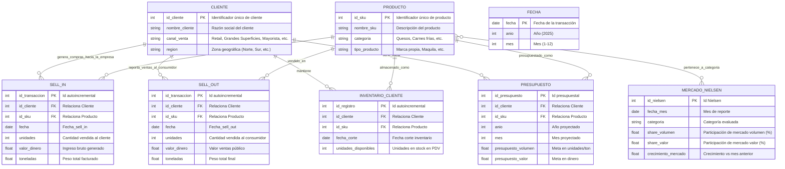

```mermaid
erDiagram
    %% Dimensiones
    CLIENTE {
        int id_cliente PK "Identificador único de cliente"
        string nombre_cliente "Razón social del cliente"
        string canal_venta "Retail, Grandes Superficies, Mayorista, etc."
        string region "Zona geográfica (Norte, Sur, etc.)"
    }

    PRODUCTO {
        int id_sku PK "Identificador único de producto"
        string nombre_sku "Descripción del producto"
        string categoria "Quesos, Carnes frías, etc."
        string tipo_producto "Marca propia, Maquila, etc."
    }

    FECHA {
        date fecha PK "Fecha de la transacción"
        int anio "Año (2025)"
        int mes "Mes (1-12)"
    }

    %% Hechos Transaccionales
    SELL_IN {
        int id_transaccion PK "Id autoincremental"
        int id_cliente FK "Relaciona Cliente"
        int id_sku FK "Relaciona Producto"
        date fecha "Fecha_sell_in"
        int unidades "Cantidad vendida al cliente"
        float valor_dinero "Ingreso bruto generado"
        float toneladas "Peso total facturado"
    }

    SELL_OUT {
        int id_transaccion PK "Id autoincremental"
        int id_cliente FK "Relaciona Cliente"
        int id_sku FK "Relaciona Producto"
        date fecha "Fecha_sell_out"
        int unidades "Cantidad vendida al consumidor"
        float valor_dinero "Valor ventas público"
        float toneladas "Peso total final"
    }

    INVENTARIO_CLIENTE {
        int id_registro PK "Id autoincremental"
        int id_cliente FK "Relaciona Cliente"
        int id_sku FK "Relaciona Producto"
        date fecha_corte "Fecha corte inventario"
        int unidades_disponibles "Unidades en stock en PDV"
    }

    PRESUPUESTO {
        int id_presupuesto PK "Id presupuestal"
        int id_cliente FK "Relaciona Cliente"
        int id_sku FK "Relaciona Producto"
        int anio "Año proyectado"
        int mes "Mes proyectado"
        float presupuesto_volumen "Meta en unidades/ton"
        float presupuesto_valor "Meta en dinero"
    }

    MERCADO_NIELSEN {
        int id_nielsen PK "Id Nielsen"
        date fecha_mes "Mes de reporte"
        string categoria "Categoría evaluada"
        float share_volumen "Participación de mercado volumen (%)"
        float share_valor "Participación de mercado valor (%)"
        float crecimiento_mercado "Crecimiento vs mes anterior"
    }

    %% Relaciones
    CLIENTE ||--o{ SELL_IN : "genera_compras_hacia_la_empresa"
    CLIENTE ||--o{ SELL_OUT : "reporta_ventas_al_consumidor"
    CLIENTE ||--o{ INVENTARIO_CLIENTE : "mantiene"
    CLIENTE ||--o{ PRESUPUESTO : "tiene_meta"

    PRODUCTO ||--o{ SELL_IN : "incluido_en"
    PRODUCTO ||--o{ SELL_OUT : "vendido_en"
    PRODUCTO ||--o{ INVENTARIO_CLIENTE : "almacenado_como"
    PRODUCTO ||--o{ PRESUPUESTO : "presupuestado_como"

    %% Relación Nielsen - Producto por Categoría
    PRODUCTO }o--o{ MERCADO_NIELSEN : "pertenece_a_categoria"
```
